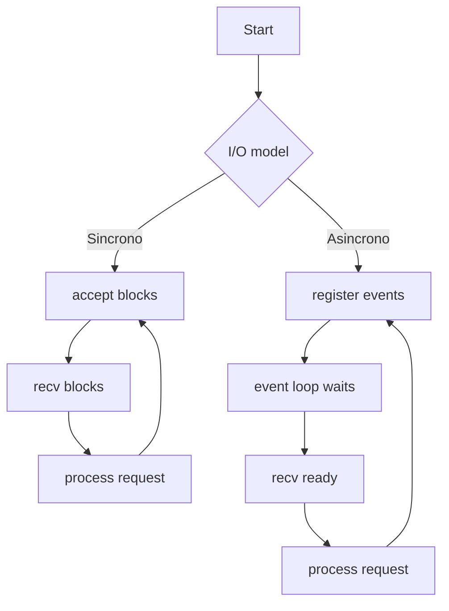
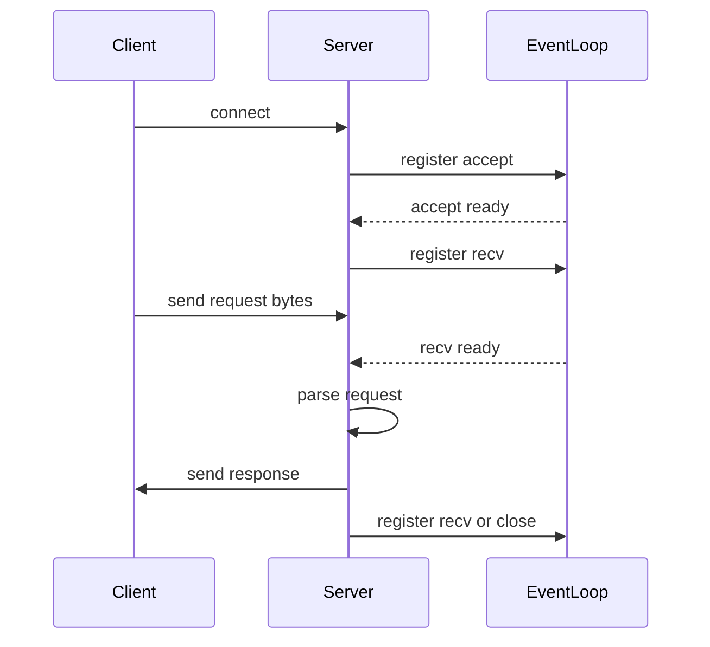
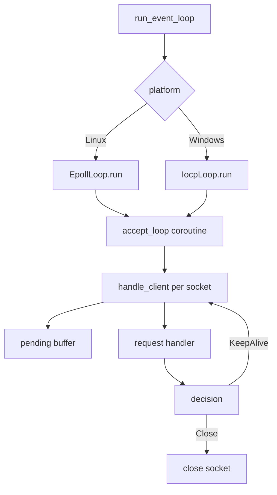

# sockets

Servidor HTTP asíncrono con epoll (Linux) e IOCP (Windows) utilizando corrutinas de C++20.

## Indice

- [Quick start](#quick-start)
  - [Build](#build)
  - [Run](#run)
  - [Tests](#tests)
- [Aprende](#aprende)
  - [Conceptos clave](#conceptos-clave)
  - [Comparativo sincrono vs asincrono](#comparativo-sincrono-vs-asincrono)
  - [Diagramas (vision general)](#diagramas-vision-general)
  - [Event loop (detalle tecnico)](#event-loop-detalle-tecnico)
    - [Beneficios para el proyecto](#beneficios-para-el-proyecto)
    - [Linux (epoll)](#linux-epoll)
    - [Windows (IOCP)](#windows-iocp)
    - [Ciclo de manejo de cliente](#ciclo-de-manejo-de-cliente)
    - [Ejemplo de caso de uso](#ejemplo-de-caso-de-uso)

## Quick start

### Build

```bash
cmake -S . -B build
cmake --build build
```

### Run

```bash
./build/sockets
```

Then open <http://localhost:8080>

### Tests

```bash
cmake --build build --target sockets_tests
./build/sockets_tests
```

## Aprende

La programacion de sockets es la base de las comunicaciones en red: un socket es un
endpoint que permite enviar y recibir bytes entre procesos a traves de TCP/UDP. En un
servidor TCP tipico el flujo es: crear socket, bind a un puerto, listen, accept y luego
leer/escribir datos por cada cliente.

En I/O sincrono (bloqueante), cada `accept()` o `recv()` detiene el hilo hasta que haya
datos. Esto es simple de entender, pero escala mal si hay muchos clientes porque suele
requerir un hilo por conexion.

En I/O asincrono (no bloqueante), el programa registra interes por eventos y el sistema
operativo notifica cuando hay datos o nuevas conexiones. Esto permite que un solo hilo
gestione muchas conexiones con menor overhead. Este proyecto implementa ese modelo con
un event loop: `epoll` en Linux e IOCP en Windows. Las coroutines permiten escribir un
flujo de lectura y parseo que parece secuencial, sin perder el comportamiento asincrono.

### Conceptos clave

- Bloqueante (blocking): una llamada de sistema no regresa hasta tener datos.
    Ejemplo: `recv()` espera bytes y detiene el hilo.
- No bloqueante (non-blocking): la llamada regresa de inmediato si no hay datos.
    Ejemplo: `recv()` retorna error tipo `EWOULDBLOCK` y el loop vuelve a esperar eventos.
- Evento: notificacion del sistema operativo de que un socket esta listo para leer/escribir.
    Ejemplo: `EPOLLIN` indica que hay datos disponibles en Linux.
- Event loop: bucle central que espera eventos y reanuda tareas suspendidas.
    Ejemplo: `epoll_wait()` en Linux o `GetQueuedCompletionStatus()` en Windows.
- Timeout de inactividad: limite de tiempo sin trafico antes de cerrar una conexion.
    Ejemplo: si un cliente no envia datos, el loop rompe la espera y cierra el socket.
- Buffer pendiente (`pending`): acumulacion de bytes hasta tener un request completo.
    Ejemplo: se agregan fragmentos de headers hasta encontrar `CRLF CRLF`.

### Comparativo sincrono vs asincrono

| Aspecto | I/O sincrono (bloqueante) | I/O asincrono (no bloqueante) |
| --- | --- | --- |
| Modelo de espera | El hilo se queda bloqueado en `accept()` o `recv()` | El hilo registra eventos y sigue con otras tareas |
| Escalabilidad | Limitada, suele requerir un hilo por cliente | Alta, un hilo puede manejar muchas conexiones |
| Latencia | Depende del numero de hilos y contexto | Mejor control con timeouts y cola de eventos |
| Complejidad | Conceptualmente simple | Requiere un event loop y manejo de estados |
| Recursos | Mas memoria y cambios de contexto | Menos overhead por conexion |

### Diagramas (vision general)





### Event loop (detalle tecnico)

`run_event_loop()` crea el loop principal y despacha a una implementacion por plataforma.
La logica esta basada en coroutines C++20: `accept_loop()` y `handle_client()` son
coroutines "fire and forget" que suspenden en operaciones de IO y se reanudan cuando
el loop entrega eventos.

#### Beneficios para el proyecto

- Escalabilidad: un solo hilo puede manejar muchas conexiones sin crear un hilo por cliente.
- Eficiencia: `epoll` e IOCP evitan el polling activo y despiertan solo cuando hay eventos.
- Latencia controlada: el loop centraliza timeouts de inactividad y cierre ordenado.
- Codigo mas claro: las coroutines hacen que el flujo de lectura/parseo se vea secuencial,
    pero sigue siendo asincrono.
- Portabilidad: misma arquitectura con backend Linux y Windows, util para comparar modelos de IO.
- Valor didactico: muestra el ciclo completo de una conexion (accept -> recv -> parse -> decision)
    sin ocultar los detalles de sockets.



#### Linux (epoll)

- `EpollAwaitable` registra el FD con `epoll_ctl(ADD|MOD)` y suspende la coroutine.
- `EpollLoop::run()` llama `epoll_wait()` con timeout fijo y luego reanuda los awaitables.
- El timeout de inactividad se implementa con una lista de waiters y un chequeo
    de expiracion en cada iteracion (`check_timeouts()`).
- `accept_loop()` espera `EPOLLIN` en el listener y acepta en un bucle hasta
    drenar todas las conexiones pendientes (manejo de `EWOULDBLOCK`).

#### Windows (IOCP)

- `IocpLoop::run()` usa `GetQueuedCompletionStatus()` con un timeout corto y
    reanuda el `OVERLAPPED` asociado.
- `AcceptAwaitable` usa `AcceptEx` y asocia el socket con el IOCP.
- `RecvAwaitable` usa `WSARecv` y registra timeouts con `CancelIoEx` cuando expiran.

#### Ciclo de manejo de cliente


`handler()` devuelve `RequestDecision`:

- `NeedMoreData`: no hay request completo aun; seguir leyendo.
- `KeepAlive`: se mantiene el socket abierto; el timeout puede ajustarse.
- `Close`: se cierra el socket y finaliza la coroutine.

#### Ejemplo de caso de uso

Caso: servidor HTTP para un curso que recibe muchas conexiones cortas (pruebas de
navegador, `curl`, y scripts de laboratorio) y necesita evitar un hilo por cliente.

1) El listener acepta multiples conexiones con `accept_loop()`.
2) Cada cliente queda en `handle_client()` y espera datos sin bloquear el hilo.
3) El parser acumula bytes en `pending` hasta encontrar el fin de headers.
4) El handler genera la respuesta y decide `KeepAlive` o `Close`.
5) El event loop aplica timeouts para cerrar conexiones inactivas.

Este flujo permite que el proyecto sea facil de explicar en clase: muestra el camino
completo de una peticion y, al mismo tiempo, como se escala usando I/O asincrono.
