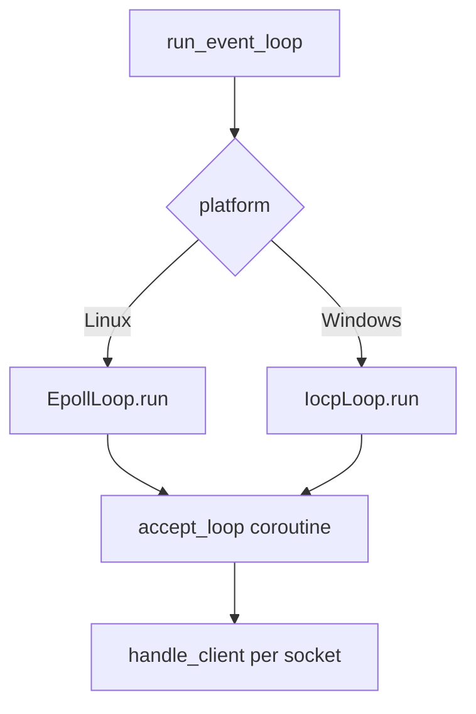
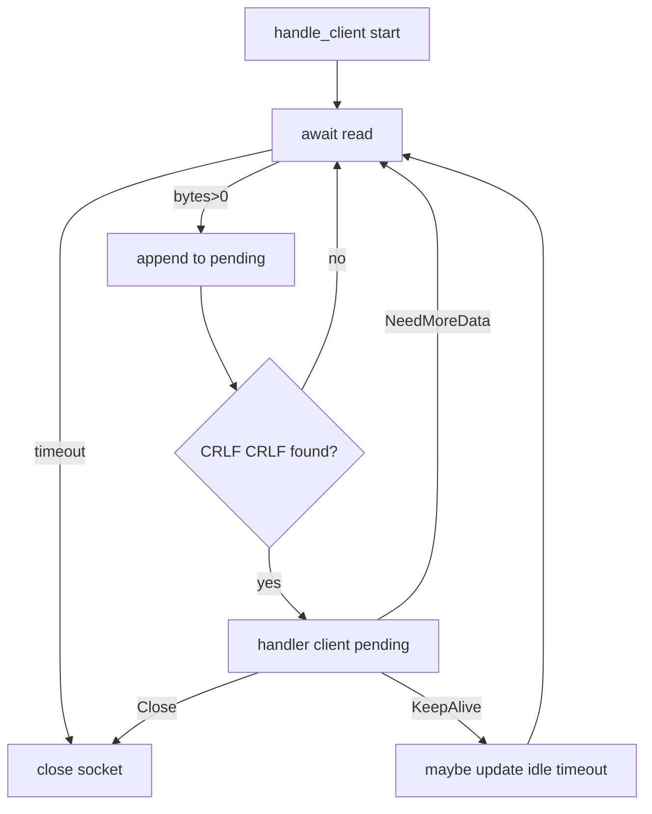

# sockets

Minimal async HTTP server with epoll (Linux) and IOCP (Windows) using C++20 coroutines.

## Build

```bash
cmake -S . -B build
cmake --build build
```

## Run

```bash
./build/sockets
```

Then open <http://localhost:8080>

## Event loop (detalle tecnico)

`run_event_loop()` crea el loop principal y despacha a una implementacion por plataforma.
La logica esta basada en coroutines C++20: `accept_loop()` y `handle_client()` son
coroutines "fire and forget" que suspenden en operaciones de IO y se reanudan cuando
el loop entrega eventos.



### Linux (epoll)

- `EpollAwaitable` registra el FD con `epoll_ctl(ADD|MOD)` y suspende la coroutine.
- `EpollLoop::run()` llama `epoll_wait()` con timeout fijo y luego reanuda los awaitables.
- El timeout de inactividad se implementa con una lista de waiters y un chequeo
    de expiracion en cada iteracion (`check_timeouts()`).
- `accept_loop()` espera `EPOLLIN` en el listener y acepta en un bucle hasta
    drenar todas las conexiones pendientes (manejo de `EWOULDBLOCK`).

### Windows (IOCP)

- `IocpLoop::run()` usa `GetQueuedCompletionStatus()` con un timeout corto y
    reanuda el `OVERLAPPED` asociado.
- `AcceptAwaitable` usa `AcceptEx` y asocia el socket con el IOCP.
- `RecvAwaitable` usa `WSARecv` y registra timeouts con `CancelIoEx` cuando expiran.

### Ciclo de manejo de cliente



`handler()` devuelve `RequestDecision`:

- `NeedMoreData`: no hay request completo aun; seguir leyendo.
- `KeepAlive`: se mantiene el socket abierto; el timeout puede ajustarse.
- `Close`: se cierra el socket y finaliza la coroutine.

## Tests

```bash
cmake --build build --target sockets_tests
./build/sockets_tests
```
